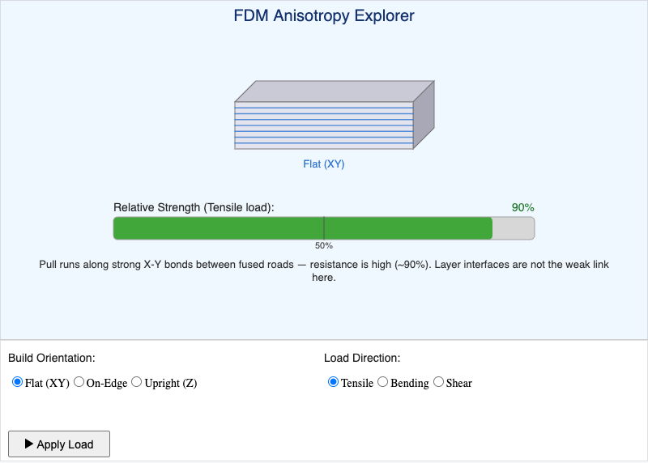

# MicroSim Generation Log: anisotropy-explorer

| Field | Value |
|-------|-------|
| **Sim ID** | anisotropy-explorer |
| **Chapter** | 2 — AM Standards, Process Families, and Industrial AM |
| **Library** | p5.js |
| **Bloom Level** | L4 Analyze |
| **Status** | implemented |
| **Generated** | 2026-05-08 |

## Files Created / Modified

| File | Action |
|------|--------|
| `docs/sims/anisotropy-explorer/anisotropy-explorer.js` | Created (190 lines) |
| `docs/sims/anisotropy-explorer/main.html` | Replaced scaffold with production HTML |
| `docs/sims/anisotropy-explorer/index.md` | Updated status, iframe height |
| `docs/sims/anisotropy-explorer/anisotropy-explorer.png` | Screenshot captured (35 KB) |

## Canvas Dimensions

| Variable | Value |
|----------|-------|
| `drawHeight` | 420 px |
| `controlHeight` | 150 px |
| `CANVAS_HEIGHT` | 570 px |
| iframe height | 572 px |

## Instructional Design

- **Bloom Level:** L4 Analyze
- **Bloom Verb:** examine, distinguish, analyze
- **Pattern chosen:** Parameter explorer with immediate visual feedback + on-demand animation
- **Rationale:** L4 requires the learner to see causal relationships; changing orientation/load updates bar and gauge instantly so patterns are discoverable. "Apply Load" animation reinforces consequence of weak combinations.

## Visual Layout Review

- PASS — isometric test bar renders clearly with color-coded layer lines (blue=XY, green=On-Edge, orange=Z)
- PASS — strength gauge with lerpColor gradient (red→green) shows correct percentage
- PASS — crack line appears for combinations < 50% strength
- PASS — explanation text updates immediately on parameter change
- PASS — all controls (2 radio groups + button) visible in 572 px iframe
- PASS — responsive layout; radio groups reposition on window resize

## Screenshot

